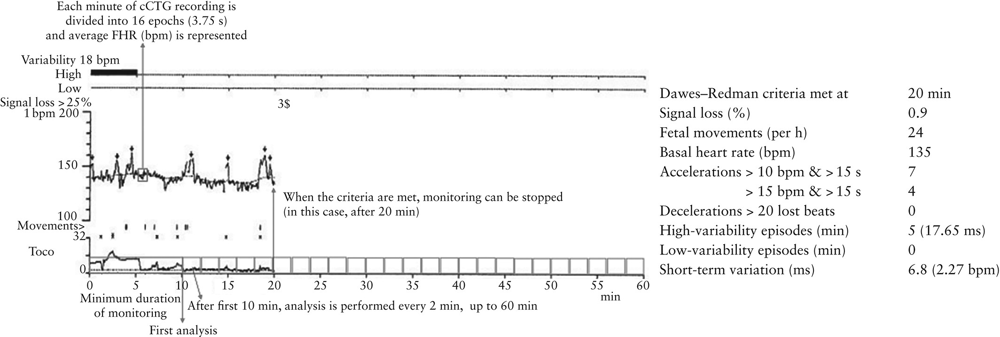

# Literature review

This is an informal review of papers predicting fetal outcomes based on FHR and/or UC signals from CTG.

## Review papers

* [Georgieva et al. 2019](https://doi.org/10.1111/aogs.13639) - Computer-based intrapartum fetal monitoring and beyond: A review of the 2nd Workshop on Signal Processing and Monitoring in Labor (October 2017, Oxford, UK)
* [M-Barek et al. 2022](https://doi.org/10.1111/aogs.14498) - Computerized cardiotocography analysis during labor – A state-of-the-art review
* [Mendis et al. 2023](https://doi.org/10.3390/bioengineering10091007) - Computerised Cardiotocography Analysis for the Automated Detection of Fetal Compromise during Labour: A Review
* [O'Sullivan et al. 2021](https://doi.org/10.3389/frai.2021.765210) - Challenges of Developing Robust AI for Intrapartum Fetal Heart Rate Monitoring

## CTG datasets

Summary of other CTG datasets, compared with the CTU-UHB dataset, created with support from [M'Barek et al. 2023](https://www.ncbi.nlm.nih.gov/pmc/articles/PMC10311205/) and [Mendis et al. 2023](https://www.ncbi.nlm.nih.gov/pmc/articles/PMC10525263/).

### Both raw recordings and features

| Dataset and links | Record number | Format of signal data | Outcome | Availability |
| --- | --- | --- | --- | --- |
| FHR morphological analysis (FHRMA) dataset - [link](https://www.sciencedirect.com/science/article/pii/S2352711018302498) | 156 | Raw FHR signals sampled at 4Hz. Features of FHR (baseline, acceleration and deceleration) as determined by 12 different methods.| None | Public[[source]](https://www.preprints.org/manuscript/201907.0039/v1) |

There is an [FHRMA github](https://github.com/utsb-fmm/FHRMA) and [FHRMA wiki](https://github.com/utsb-fmm/FHRMA/wiki).

The raw FHR records are available for the [training](https://github.com/utsb-fmm/FHRMA/tree/master/FHRMAdataset/traindata) and [test](https://github.com/utsb-fmm/FHRMA/tree/master/FHRMAdataset/testdata) data. These are .fhr files which can be opened with the fhropen.m function in MATLAB. They were sampled at 4Hz. For each sample, a uint32 serves as the UNIX timestamp for the beginning of the recording. Next, a uint16 corresponds to the FHR from the first sensor (multiplied by 4), a uint16 for the FHR signal from the second sensor (multiplied by 4) (unused here), a uint8 for the TOCO signal (multiplied by 2), and a uint8 reserved to store signal quality (unused here). 

The main folder in the GitHub repository contains functions from the software, including functions for analysis with the 12 methods, which follow a file structure of 'aa'm then method - e.g. [aamwmfb.m](https://github.com/utsb-fmm/FHRMA/blob/master/aamwmfb.m).

[The analyses folder in the github](https://github.com/utsb-fmm/FHRMA/tree/master/FHRMAdataset/analyses) contains MAT files which have record of when accelerations and decelerations occur for each record, according to the different methods. The methods are [listed here](https://github.com/utsb-fmm/FHRMA/wiki/FHRMA-dataset). As described on the [dataset page](https://github.com/utsb-fmm/FHRMA/wiki/FHRMA-dataset), these files contain:
* Filename (name of the record)
* Baseline (baseline signal sampled at 4Hz)
* Accelerations (2xn table with beginning and end of each acceleration in minutes)
* Decelerations (2xn table with beginning and end of each deceleration in minutes)
* Overshoots (2xn table with beginning and end of overshoots in minutes) (excluded from evaluation)
* Unreliable signal (periods of maternal heart rate or too much missing signal preventing good analysis) (excluded from evaluation)
* Not to analyse (period not to be analysed due to insufficient signal before or after for baseline positioning)
* Training data (boolean set to 1 if recording is part of the training dataset and 0 of part of evaluation)

The baseline, accelerations, decelerations, and over-shoots are not publicly shared for the recordings in the evaluation dataset to avoid any training on those data.

It states that the files are also available in WFDB format on the PhysioNet page, but I've not yet been able to identify the Physionet page.

These files are either from **expert evaluation, or automated analysis** from 12 different methods available in the literature. Methods in table below as from [[source]](https://doi.org/10.1016/j.softx.2020.100428), ordered by their performance in their evaluation of them. Not included in FHRMA but included in the leaderboard are two methods from Zhong et al. 2022, which perform in 1st and 3rd place.

| Function name | Filename | Publication | Baseline computation method | Acceleration/deceleration thresholding described? |
| --- | --- | --- | --- | --- |
| aamwmfb | WMFB_orig.mat | Boudet et al. (2020) | Based on a weighted median filter baseline (WMFB). The weights are set to the prior probabilities that the FHR is in the baseline state. The unstable FHR periods have low probabilities. Successive baselines are computed with a progressive trimming process. Periods far from previous baselines have also low probabilities. | Yes |
| aamlu | L_std.mat | Lu et Wei (2012) | A method using empirical mode decomposition; periods exhibiting significant differences between two successive local FHR minima are excluded from the baseline computation. | No (probably standard thresholding) |
| aamhouze | H_std.mat | Houzé et al. (1990) | Based on a series of logic rules applied to various signal derivatives, followed by a smoothing step. | No (not described clearly enough to be reprogrammed) |
| aamtaylor | T_orig.mat / T_std.mat | Taylor et al. (2000) | A linear low-pass filtering method with progressive trimming. | Yes |
| aamwrobel | W_std.mat | Wróbel et al. (2013) | Based on myriad filters: an intermediate approach, between a linear average filter and use of the mode. | No (probably standard thresholding) |
| aammongelli | MG_std.mat | Mongelli et al. (1997) | This method computes a primary mode and a secondary mode; the two modes can be switched, depending on continuity and frequency criteria. | No |
| aamayres | A_std.mat | Ayres de Campos et al. (2000) | Based on “frequent” FHR values in a 10-min moving window. | Yes (= standard thresholding) |
| aammantel | MT_orig.mat / MT_std.mat | Mantel et al. (1990) | The method uses the mode or another local maximum of the FHR histogram to obtain an initial baseline. The final baseline is obtained by progressively trimming the first baseline (based on Dawes et al.’s method). This method was developed for antepartum recording. | Yes |
| aampardey | P_std.mat | Pardey et al. (2002) | The method first uses the histogram’s mode or another local maximum. The second baseline is obtained by linear filtering of the FHR and trimming as a function of the first baseline (based on Dawes et al.’s method). | Yes (=standard thresholding) |
| aamjimenez | J_orig.mat / J_std.mat | Jimenez et al. (2002) | Unstable periods (with a derivative above a cut-off) are removed, and the baseline is calculated after smoothing the remaining signal. | Yes |
| aammaeda | MD_std.mat | Maeda et al. (2012) | The baseline is set to the FHR level that occurs most often within a 10 bpm-wide bin. | No (not described clearly enough to be reprogrammed) |
| aamcazares | C_orig.mat/ C_std.mat | Cazares et al. (2002) | Based on morphological filters; an opening filter removes accelerations and a closing filter removes decelerations. | Only described for acceleration (presumably the same for deceleration) |

It also contains work around identification of false signals which is described in [this pre-print](https://www.preprints.org/manuscript/202207.0131/v1) and in [these python files](https://github.com/utsb-fmm/FHRMA/tree/master/FS%20training%20python%20sources).

In their [presentation on YouTube](https://youtu.be/gjpBs4utlbM?si=Y4HOXwd0FEzbbZiD&t=1146), can see that the training and test data are from two different sources:
* Training dataset is 66 recordings, duration 90 min (30 min - 7 hours), digitial acquisition or scan, medium or hard to assess, consensus of 3 experts
* Test dataset is 90 recordings, duration 105 min (90 min - 120 min), digitial acquisition, easy or medium or hard to assess, 3 independent experts and a consensus

### Raw recordings

| Dataset and links | Record number | Format of signal data | Outcome | Availability |
| --- | --- | --- | --- | --- |
| CTU-UHB dataset - [link](https://physionet.org/content/ctu-uhb-ctgdb/1.0.0/) | 552 records (40 with pH < 7.05) | Raw FHR and UC at 4Hz (with annotation of 5 features also available) recorded with ultrasound and/or scalp electrode | pH, base deficit, Apgar (with expert annotation performed but not available) | Public |
| Signal Processing and Monitoring (SPaM) dataset with data from JR Hospital, Oxford, UK; HFME Lyon, France; FN Brno, Czech Republic, from the SPaM workshop - [link to data](https://users.ox.ac.uk/~ndog0178/CTGchallenge2017.pdf) and [link to workshop paper](https://www.ncbi.nlm.nih.gov/pmc/articles/PMC7135636/) | 300 records (80% pH 7.25 to 7.3, 20% pH < 7.05) | Raw FHR and UC recordings at 4Hz (I think) | pH | Publically available, uncertain of license |
| Base Bien Naître (BBN) database - [link](https://doi.org/10.1016/j.ejogrb.2022.04.004) | 11026 complete files that meet inclusion criteria | Raw FHR and UC at 4Hz recorded using AVALON FM50 monitor connected via an RS232 link to an RS232/Ethernet hub | At least pH, base excess, 1 + 5 min Apgar | Not public as French leglislation on healthcare prevents this, but data can be made available on a reasonable request, and in future it might be possible to provide public access to a limited part of the dataset
| Beaujon dataset (University Hospital Beaujon) - [link](https://www.ncbi.nlm.nih.gov/pmc/articles/PMC10311205/) | 675 (42 with pH < 7.05) | Raw FHR and UC | At least pH, Apgar1, Apgar5 | Not yet found data online, but paper states "the raw data supporting the conclusions of this article will be made available by the authors, without undue reservation" |
| Lyon dataset - collected at the French public university Hospital Femme-Mere-Enfant, from 2000 to 2010 - [link](https://doi.org/10.1016/j.ejogrb.2010.12.042) | 3112 | Raw FHR and UC at 10Hz. STAN S21 or S31 devices via internal fetal scalp electrodes. Beat to beat measurement were resampled into a beat-per-minute time series at 10Hz | pH | Private |
| NanFang Hospital of Southern Medical University - [described here](https://doi.org/10.1097/FM9.0000000000000147) | 2341 records (filtered from 43888) | Raw FHR monitored using ObVue fetal monitoring system | Unsure | Private |
| Oxford dataset - [link](https://openaccess.sgul.ac.uk/id/eprint/111360/1/08788528.pdf) | 35,429 | Raw FHR and UC at 4Hz | pH | Private |
| Dataset of collaborating hospitals (appears to be in China) | 16355 records (11998 normal, 4326 suspicious, 31 pathological) | Raw FHR and UC recorded with SRF618A pro fetal monitor at 1.25 Hz | Classification as normal, suspicious or pathological | Private |
| Xi'an Jiaotong University (XJTU) database - [link](https://doi.org/10.1002/ijgo.15236) | 2542 CTG records from 1551 patients (1520 CTG records from 555 patients in the normal group and 1022 CTG records from 996 patients in the case group) | Raw FHR and UC at 4Hz | Normal or case, based on ACOG and FIGO guidelines | Private (data availability statement: the research data are not shared) |

### Features
| Dataset and links | Record number | Format of signal data | Outcome | Availability |
| --- | --- | --- | --- | --- |
| University of California Irvine Machine Learning (UCI ML) Repository Cardiotocography Dataset - [link](https://archive.ics.uci.edu/dataset/193/cardiotocography) | 2126 (1655 normal, 295 suspect, 176 pathologic) | Features of FHR and UC (e.g. baseline, accelerations, movements, contractions). Features created by SisPorto 2.0 which automatically analysed the CTG results. | Consensus classification by 3 expert obstetricians as normal, suspect or pathological | Public |

### fECG datasets

There are other monitoring techniques like fetal ECG. Examples of publicly available dataset on PhysioNet of fetal ECG (as from [this review](https://ieeexplore.ieee.org/document/8820039)):
* The Abdominal and Direct Fetal ECG Database (ADFECGDB)
* The Non-Invasive Fetal Electrocardiogram Database (NIFECGDB)
* The 2013 PhysioNet/Computing in Cardiology Challenge Database
* The Fetal ECG Synthetic Database (FECGSYNDB)
* The Non-invasive Fetal ECG Arrhythmia Database (NIFEADB) 

## Antenatal analysis

The development of antepartum computerized CTG (cCTG) began in 1978 based on criteria devised by Geoffrey Dawes and Chris Redman (Dawes–Redman criteria). Since then, the algorithm has been upgraded and improved repeatedly, and is now reportedly based on approximately 100 000 CTG traces linked to clinical outcome data spanning 20 years. The main advantage of cCTG with Dawes–Redman criteria over ‘conventional’ CTG is that it expresses components of the fetal heart rate (FHR) in an objective and numerically quantifiable way. This has led to cCTG being adopted as the recommended tool for antepartum monitoring over CTG in the UK by the NHS Saving Babies' Lives Care Bundle (SBLCBv2).[[source]](https://obgyn.onlinelibrary.wiley.com/doi/10.1002/uog.26198 )

The computation of the Dawes–Redman criteria remains proprietary knowledge. Minimum duration of fetal monitoring is 10 min; analysis is performed at 10 min and every 2 min thereafter, up to a maximum of 60 min. In the presence of sufficient elements to be classified as normal (i.e. ‘criteria met’), monitoring can be stopped. The main components are:

[[source]](https://obgyn.onlinelibrary.wiley.com/doi/10.1002/uog.26198 )

The Dawes-Redman analysis cannot be used in the presence of uterine contractions as this can be falsely reassuring.

It was commercialised as the Huntleigh Healthcare Ltd Sonicaid FM800. “Huntleigh are the exclusive worldwide distributor (under the licence from Oxford University) for the genuine Dawes-Redman analysis developed by Dawes, Redman et al, at the University of Oxford. Products produced by other companies will not have been validated against the University of Oxford’s unique database (where the system was and continues to be developed) and therefore will not perform in the same way.”[[source]](https://www.huntleigh-diagnostics.com/sonicaid-dawes-redman-ctg-analysis)

## Studies evaluating the use of CTG analysis systems in clinical practice

Several of the automated analysis methods have been developed as commercial products and evaluated in clinical practice. These are decision-support systems which provide alerts when there are concerns.[[source]](https://doi.org/10.3390/bioengineering10091007)

There are some systems for monitoring during labour (antenatal) (e.g. System 8000 (Dawes and Redman) and improved version called sonicadFetalCare; 2CTG2). For monitoring during labour, systems include:
* **Porto** (based on FIGO), later commercialised **SisPorto** and **Omniview-SisPorto**, and the latest version is **Sis-Porto 4.0** (based on 2015 FIGO guidelines) - as described in [Ayres-de-Campos et al. 2017](https://doi.org/10.3109/14767058.2016.1161750)
* **INFANT** (K2 Medical Systems, Plymouth, UK) - as described in [this Lancet publication](https://doi.org/10.1016%2FS0140-6736(17)30568-8), although note that the co-inventor of INFANT, co-founder of K2 Medical Systems, and member of authorship and Clinical Investigator's group resigned as author from the paper [as in this commentary](https://doi.org/10.1016/S0140-6736(17)30714-6)
* **OxSys** is a new prototype that analyses and triggers 

Most of these systems have undergone years of work, testing and clinicial validation in randomised controlled trials (RCTs). Description of some of the studies, as from [[source]](https://doi.org/10.3390/bioengineering10091007):
| Software | Study design | Sample size | Outcome |
| --- | --- | --- | --- |
| INFANT | RCT | 46042 | **No difference**. Incidence of poor neonatal outcomes was the same regardless of using the decision support system, 0.7% in both groups (adjusted risk ratio 1.01, 95% CI:0.82–1.25) |
| Omniview-SisPorto 3.5 | RCT | 7730 | **No difference**. While both study arms reported lower than expected rate of newborn metabolic acidosis, no significant reduction in the metabolic rate or obstetric intervention was achieved using computerised analysis (relative risk 0.69, 95% CI:0.36–1.31) |
| OxSys 1.5 | Retrospective | 22790 | **Sensitivity change not stat sig, FPR change was**. OxSys system potentially increased the sensitivity of fetal compromise detection (43.3% vs. 38.0% for severe, p = 0.3 and 36.1% vs. 31.0% for moderate, p = 0.06) while reducing the false positive rate (14.4% vs. 16.3%, p < 0.001) compared to conventional clinical diagnosis; however, the sensitivity increase was not statistically significant.|

Two recent **meta-analyses** also concluded similar findings that **computerised CTG analysis did not improve neonatal outcomes compared to conventional evaluation**.[[source]](https://doi.org/10.3390/bioengineering10091007)

## Methods using human-guided features (e.g. PICO guidelines acceleration, deceleration) of the signals (either papers focusing on producing the features, or also doing classification)

| Paper | Dataset | Signal cleaning | Signal segmentation | Feature extraction | Feature selection | Outcome | Imbalance | Model | Reproducibility? |
| --- | --- | --- | --- | --- | --- | --- | --- | --- | --- |
| [Abry et al. 2018](https://doi.org/10.1088/2057-1976/aabc64) - Sparse learning for Intrapartum fetal heart rate analysis | CTU-UHB and Lyon | Gestational age ≥37 weeks, maternal age ≥18, tracing ending less than 20 min before delivery, after-delivery pH measurement available, less than 50% of missing data in either stage of the delivery process. | Split into sets depending on duration of second stage - set one is second stage duration <>= 15 min corresponding to births during stage 1 or early stage 2 - and set two if duration of second stage > 15 min and so birth during (possibly long) second stage. Because pH measured at delivery can only be reminiscent of the health status of fetuses in the last minutes of labor, FHR analysis was only conducted in the last 20 min of either set. | 20 features (FIGO-like, classical spectral, and scale-free). Provides references, but looking at the papers (e.g. [Spilka et al. 2012](https://doi.org/10.1016/j.bspc.2011.06.008)) they are very complicated (lots of formula). | Feature sparsity in sparse support vector machine | pH <=7.05 acidotic, others normal | Modify penalisation term | Sparse support vector machine |
| [Boudet et al. 2019](https://doi.org/10.20944/preprints201907.0039.v1) - Fetal Heart Rate Signal Dataset for Training Morphological Analysis Methods and Evaluating them Against an Expert Consensus | FHRMA (paper describes creation of this dataset)| | | | NA | NA | NA | NA | Provides [GitHub repository](https://github.com/utsb-fmm/FHRMA) and project website (although that page no longer found)
| [Boudet et al. 2019](https://doi.org/10.1016/j.compbiomed.2019.103468) - Fetal heart rate baseline computation with a weighted median filter | FHRMA (paper describes WMFB method for morphological analysis which they describe as current best) | | | | NA | NA | NA | NA | This states that all training and evaluation material used is available at http://utsb.univ-catholille.fr/fhr-review but the page now shows as not found. However, I managed to find the related [GitHub repository](https://github.com/utsb-fmm/FHRMA). |
| [Boudet et al. 2020](https://doi.org/10.1016/j.softx.2020.100428) - A fetal heart rate morphological analysis toolbox for MATLAB | FHRMA (paper describes the MATLAB toolbox for this dataset/ analysis)| | | | NA | NA | NA | NA | Open-source toolbox that has a standard pre-processing function, 12 re-coded literature methods for FHR analysis, a signal viewer (enabled expert annotation) and evaluation procedure. Provides [link to documentation](http://utsb.univ-catholille.fr/fhr-review) (doesn't work), [link to code](https://github.com/ElsevierSoftwareX/SOFTX%5F2018%5F217) (doesn't work) and [link to software](https://github.com/utsb-fmm/FHRMA) (does still work). This is a link to the [software on MATLAB](https://uk.mathworks.com/matlabcentral/fileexchange/115890-fetal-heart-rate-morphological-analysis-toolbox-fhrma) |
| [Cömert and Kocamaz 2018](https://doi.org/10.1016/j.bspc.2018.05.016) - Open-access software for analysis of fetal heart rate signals | CTU-UHB | | | This describes CTG-OAS, an open-access software. Provides 11 files with automated analysis methods| NA | NA | NA | NA | Open-access, although the link to the website doesn't work (warns of explicit content), and I can't find it on MathWorks. This is [Comert's GitHub](https://github.com/zcomert) but can't find it linked from there. |
| [Cömert et al. 2019](https://doi.org/10.1007/s13755-019-0079-z) -  Prediction of intrapartum fetal hypoxia considering feature selection algorithms and machine learning models | CTU-UHB | | | This includes description of improvements to CTG-OAS, which now produces 30 features | Various feature selection algorithms | pH < 7.20 | | Artificial neural network (ANN), K-nearest neighbour (KNN), support vector machine (SVM) | Link doesn't work (warns of explicit content)
| [Czabanski et al. 2023](https://doi.org/10.1016/j.asoc.2023.110790) - Refining the rule base of fuzzy classifier to support the evaluation of fetal condition | CTU-UHB | Unsure | Can't spot anything saying they did | 12 features determined by computerised fetal monitoring system, FHR features in time domain plus number of uterine contractions. Examples like mean FHR baseline, FHR accelerations per hour, etc. They provide formula and descriptions in their [supplementary 2](https://ars.els-cdn.com/content/image/1-s2.0-S1568494623008086-mmc2.pdf), and although some would still be tricky (e.g. number of accelerations per hour with no formula), other appear more straightforward (e.g. mean vaseline, variability index might be possible to calculate) | No | pH <= 7.05, 7.10, 7.15 and 7.20 | Modified CPP | Two-stage TSK fuzzy classifier - first classifier labels normal or abnormal with highest accuracy - based on training set where pH 7.05 to 7.20 are removed |
| [Das et al. 2023](https://doi.org/10.1038/s41598-023-27707-z) - A machine learning pipeline to classify foetal heart rate deceleration with optimal feature set | CTU-UHB | | | Classifying deceleration | NA | NA | NA | NA | |
| [Feng et al. 2023](https://doi.org/10.1186%2Fs12911-023-02378-y) - A hybrid stacked ensemble and Kernel SHAP-based model for intelligent cardiotocography classification and interpretability | UCI ML, and private dataset of 16355 cases | | | As above for UCI ML, and unclear from paper for the private dataset, but creates set of 24 CTG features, alongside gestational age and age of parent | | Expert evaluation as normal, suspicious or pathologic | Use F1 score to evaluate performance, and RF is part of classifier and it effectively handles imbalanced datasets | Stacked ensemble classifier (base learners SVM, XGB, RF, and meta learner backpropagation), with Kernel SHAP applied to estimate contribute of features and their relationships to fetal states |
| [Frasch et al. 2021](https://doi.org/10.3389/fped.2021.736834) - Detection of Preventable Fetal Distress During Labor From Scanned Cardiotocogram Tracings Using Deep Learning | | | | | NA | NA | NA | NA | |
| [Georgoulas et al. 2017](https://doi.org/10.1007/s12553-017-0201-7) - Investigating pH based evaluation of fetal heart rate (FHR) recordings | CTU-UHB | Removed non-physiologic extreme (<50pm and >200bpm), hermite spline interpolation to fill missing, don't include long gaps (>15s) in feature extraction process (references how this is an established pre-processing technique but other more elaborate have been proposed) | Last 30min of first stage of labour | FIGO-based features, time-domain features, frequency domain features, and non-linear domain features. All are quite common and described elsewhere | Hybrid approach with filtering based on AUC then eye-inspection based on expert feedback | pH <= 7.05 | 44 abnormal, 508 normal. Performed 44-fold stratified cross-validation | LS-SVM |
| [Georgoulas et al. 2020](https://doi.org/10.1007/s11760-020-01727-y) - An exploratory approach to fetal heart rate–pH-based systems | CTU-UHB | Artifact rejection based on thresholding and interpolation (provides reference) | Last 30 min of first stage of labour | 54 conventional features (provides reference), as well as features based on SAX representation | AUC-based selection. Created 54 subsets ranging from 1 to 54 variables. Four methods of dimensionality reduction: MDS, Sammon mapping, Isomap, and CCA | pH 7.05 to distinguish normal and pathological | SMOTE (but don't use synthetic in evaluation) | Two simple nonparametric classifiers, the minimum Mahalanobis distance classifier, a quadratic classifier and a simple parametric classifier, the k-nearest neighbor (k-nn) classifier. Ambition of study is not classification, but to illustrate issue of using pH as outcome. It argues that the limitation of FHR-pH means additional clinicial information should be used in feature set and/or alternative labelling process (although likely not natural division of normal and pathological) - though recent work proposed latent class analysis model for aggregating expert opinions, which they will do similar work to explore |
| [Hoodbhoy et al. 2019](https://doi.org/10.4103%2Fijabmr.IJABMR_370_18) - Use of Machine Learning Algorithms for Prediction of Fetal Risk using Cardiotocographic Data | UCI ML | NA | NA | As above for UCI ML (21 features) | | Expert classification as normal, suspicious or pathological | SMOTE (on training only) | 10 ML models, XGBoost was best performance | Python, [some related code available on GitHub](https://github.com/Jacobheyman702/Predicting-Fetal-Risk-Using-Cardiotocographic-Data) |
| [Houzé de l’Aulnoit](https://doi.org/10.1016/j.bspc.2018.10.002) - Automated fetal heart rate analysis for baseline determination and acceleration/deceleration detection: A comparison of 11 methods versus expert consensus | FHRMA (paper describes morpholigical analysis used in/related to dataset)| | | | NA | NA | NA | NA | The [website link](http://utsb.univ-catholille.fr/fhr-review/) doesn't work, but they also link to the [pre-print](https://www.preprints.org/manuscript/201907.0039/v1)from which you can find the [FHMRA github repository](https://github.com/utsb-fmm/FHRMA) which provides links through to the [WMFB method](https://github.com/utsb-fmm/FHRMA/wiki/The-Weighting-Median-Filter-Baseline-(WMFB)-Method). |
| [Hussain et al. 2022](https://doi.org/10.3390/s22145103) - Accessing Artificial Intelligence for Fetus Health Status Using Hybrid Deep Learning Algorithm (AlexNet-SVM) on Cardiotocographic Data | UCI ML | NA | NA | As above for UCI ML | | | | Deep transfer learning, ADAM optimizer |
| [Karvelis et al. 2015](https://doi.org/10.1088/0967-3334/36/5/1001) - Combining latent class analysis labeling with multiclass approach for fetal heart rate categorization | CTU-UHB | | | Morphological features (describing FHR morphology following FIGO guidelines) and ferques from other domains: time (mainly first and second order statistics), frequency (energy in spectral bands), and nonlinear (complexity, entropy, and fractal measures) | | From the original dataset three new datasets with binary labels are created. In the first one, the Normal class is placed against the remaining three classes that represent the 'Target' output. In the second one, the Normal and Normal/Suspicious classes are put together against the combined class of Suspicious/Pathological and Pathological cases, which now form the 'Target' class and finally in the third dataset the Pathological class, which is named the 'Target' class, is placed against the other three classes. | | Latent class analysis, logistic regression, decision tree |
| [Leonarduzzi et al. 2015](https://doi.org/10.1007/978-3-319-13117-7_129) - p-Leader Based Classification of First Stage Intrapartum Fetal HRV | Lyon |
| [Leonarduzzi et al. 2015](https://doi.org/10.1109/EMBC.2015.7318771) - P-leader multifractal analysis and sparse SVM for intrapartum fetal acidosis detection | Lyon |
| [Lu et al. 2019](https://doi.org/10.1016/j.future.2019.07.052) - A framework for intelligent analysis of digital cardiotocographic signals from IoMT-based foetal monitoring | | | | | NA | NA | NA | NA | |
| [M'Barek et al. 2023](https://doi.org/10.3389/fped.2023.1190441) - DeepCTG® 1.0: an interpretable model to detect fetal hypoxia from cardiotocography data during labor and delivery | Three dataset: CTU-UHB, SPaM, and Beaujon | Compare model performance with linear interpolation v.s. cubic Hermite spline interpolation - similar results. Decreasing maximum duration to fill gaps from 10min to 1min, looked at impact on model, and decided to use 10min. | Last available 30minutes (with model evaluated with varying length of CTG segmenet, and inclusion of ceasareans in the dataset) | 25 features described in detail, could be feasible to calculate | Compared models with different number of features, e.g. 25, 4 (minimum and maximum value of fetal heart rate baseline and area covered by accelerations and decelerations) | Default pH < 7.05. For CTU-UHB, compare performance against 9 expert obsteitricians annotations and with other published models. | Cases weighted | Univariate logistic regression, multivariate logistic regression (comparing models fed with different number of features) |
| [O'Sullivan et al. 2021](https://doi.org/10.23919/EUSIPCO54536.2021.9616289) - Classification of fetal compromise during labour: signal processing and feature engineering of the cardiotocograph | CTU-UHB | Patients with over 30% missing trace were removed. Artifacts were: <50bpm, >210bpm, change >30% from moving average, removal of MHR by discarding sequences of significantly lower FHR values than the baseline between abrupt signal changes, and gaps in samples | | Over 140 standard features from stats, time, frequency and non-linear domains were computed based on prior art, such as baseline, variability, entropy, wavelets and spectral densities | | Composite of pH and Apgar5 to label "healthy" or "at-risk". Normal is pH >= 7.15 and Apgar5 >= 9. At-risk is pH <= 7 and Apgar5 <=6 | 310 normal, 23 at risk |
| [Parvathavarthine et al. 2020](https://ejmcm.com/uploads/paper/cb23111afa325b116bb41b476f33a0f7.pdf) - Optimized residual convolutional learning neural network for intrapartum maternal-embryo risk assessment | CTU-UHB | | | CTG viewerlite and RHRV package | Boruta, RFE, SA | pH 7.15 | | Optimised ResNet50 |
| [Rahmayanti et al. 2022](https://doi.org/10.1016/j.procs.2021.12.130) - Comparison of machine learning algorithms to classify fetal health using cardiotocogram data | UCI ML | Remove outliers. Feature scaling. | NA | NA | Remove multicolinearity using VIF | Concensus expert classification | Upsampling | ANN, LSTM, XGB, SVM, KNN, LGBM, RF (in Python) |
| [Spilka et al. 2013](https://doi.org/10.1007/978-3-642-40093-3_4) - Automatic Evaluation of FHR Recordings from CTU-UHB CTG Database | CTU-UHB | Cubic Hermite spline interpolation where bpm <= 50 or >= 210. Interpolate when length of missing <=15 sec based on FIGO guidelines and their experiments. | | More than 50 features from classical morphological features based on FIGO guidelines to frequency-domain and non-linear features | Selected using the RELIEF (RELevance In Estimating Features) technique | pH <= 7.05 | SMOTE to pathological class | Adaboost |
| [Spilka et al. 2014](https://doi.org/10.1007/978-3-319-07064-3_45) - Discriminating Normal from “Abnormal” Pregnancy Cases Using an Automated FHR Evaluation Method | CTU-UHB |
| [Spilka et al. 2015](https://doi.org/10.1109/EMBC.2015.7318861) - Intrapartum fetal heart rate classification from trajectory in Sparse SVM feature space | Lyon |
| [Spilka et al. 2016](https://doi.org/10.1007/978-3-319-32703-7_232) - Intrapartum Fetal Heart Rate Classification: Cross-Database Evaluation | Lyon and CTU-UHB |
| [Spilka et al. 2017](https://doi.org/10.1109/JBHI.2016.2546312) - Sparse Support Vector Machine for Intrapartum Fetal Heart Rate Classification | Lyon |
| [Stylios et al. 2016](https://doi.org/10.1007/978-3-319-32703-7_234) - Least Squares Support Vector Machines for FHR Classification and Assessing the pH Based Categorization - [full text](https://kic.uoi.gr/wp-content/uploads/2020/04/Least-Squares-Support-Vector-Machines-for-FHR-Classification.pdf) | CTU-UHB | Hermite spline interpolation to fill short gaps (<15 sec) | Last 30 minutes of 1st stage of labour | 54 features: morphological features trying to quantify FIGO rational (number of accelerations, number of decelerations, baseline value, etc.) and time-domain (measures of variability), frequency domain (energey at different frequency bands), non-linear domain (approximate entropy, sample entropy, lempel ziv complexity, fractal dimension, detrend fluctuations analysis, etc.) | Filter selection - sort features by AUC (as not affected by class imbalance) - then analysis with (a) top 3 features (b) top nine features, (c) all 54 features | pH <= 7.05 | Unequal penalty costs in LS-SVM | LS-SVM | 
| [Zhang et al. 2023](https://doi.org/10.1002/ijgo.15236) - Intelligent classification of cardiotocography based on a support vector machine and convolutional neural network: Multiscene research | Private dataset of 2542 records from Xi'an Jiaotong University (XJTU) | | | | | | Dynamic threshold, SVM and CNN |
| [Zhong et al. 2022](https://doi.org/10.1097/FM9.0000000000000147) - CTGNet: Automatic Analysis of Fetal Heart Rate from Cardiotocograph Using Artificial Intelligence | Private dataset of 2341 records from NanFang Hospital of Southern Medical University | | | CTG-net - uses deep learning to calculate FHR baseline, and acceleration and deceleration intervals. Based on UNet. Consists of encoder, decoder and skip connections. Compared performance with the 12 methods in FHRMA. | NA | NA | NA | NA | CTGNet trained in Python using Keras, Numpy and Sklearn. Method efficacy analysed in MATLAB R2021a. However, I cannot find the code as of yet. The results are included in the FHRMA leaderboard but not the implementation.
| [Zhao et al. 2018](https://doi.org/10.3390/jcm7080223) - A Comprehensive Feature Analysis of the Fetal Heart Rate Signal for the Intelligent Assessment of Fetal State | CTU-UHB | | | CAS-FHR (developed in MATLAB, obstetricians used it to analyse the signals and obtain the features automatically) | Chose 47 most comprehensive features | | | Decision tree, support vector machine, and adaptive boosting |

This uses a few indicators from CTG (I think pre-early stage?) - https://obgyn.onlinelibrary.wiley.com/doi/10.1111/1471-0528.17669

## Methods that do not involve making human-guided features (e.g. deep learning)

| Paper | Dataset | Signal cleaning | Signal segmentation | Signal transformation | Outcome | Imbalance | Model | Software | 
| --- | --- | --- | --- | --- | --- | --- | --- | --- |
| [Baghel et al. 2022](https://doi.org/10.1016/j.bspc.2021.102794) - 1D-FHRNet: Automatic Diagnosis of Fetal Acidosis from Fetal Heart Rate Signals | CTU-UHB | Signal filtering (Gaussian butter worth bandpass filter, high-cut at 20 Hz, low-cut at 200 Hz, Gaussian parameter 5 to blur filter edges). Conversion into 19200 vectors by resampling. | No (describes mean signal length as 62 second but don't see why as appears to use full signal) | STFT producing dB-scaled spectogram | pH < 7.15 | 105 abnormal 447 healthy | CNN | Python |
| [Bursa and Lhotska 2017](https://doi.org/10.1007/978-3-319-64265-9_9) - The Use of Convolutional Neural Networks in Biomedical Data Processing | CTU-UHB | No filtering or artefact removal | Not described though figures show 5000-19,000 quarter of a second. Exclude record 4004 due to error in FFT | FFT with varying window lengths (though didn't pursue as accelerations and decelerations didn't respond to shapes in spectogram, and visual inspection of UC didn't bring much info). CWT using Morlet wavelet with omega 4 or 8. | pH <= 7.15 | 1756 normal and 448 pathological | CNN | ? |
| [Cao et al. 2023](https://doi.org/10.1007/s13755-023-00219-w) - Intelligent antepartum fetal monitoring via deep learning and fusion of cardiotocographic signals and clinical data | Private dataset with 16355 records (appears to be China) | FHR deleted outliers, interpolation, standardisation (pre-treatment result - fetal heart baseline). UC interpolated or deleted simultaneously. | Last 15 minutes | No | Expert classification of normal or abnormal (suspicious or pathological) | No? | Multimodal deep learning architecture - first a CNN model (6 layers) with FHR and UC signals, then LGBM with gestational and maternal age added | Python |
| [Cömert and Kocamaz 2016](https://www.ijcaonline.org/archives/volume156/number4/c%C3%B6mert-2016-ijca-912417.pdf) - Evaluation of Fetal Distress Diagnosis during Delivery Stages based on Linear and Nonlinear Features of Fetal Heart Rate for Neural Network Community | CTU-UHB | Determine missing beats, interpolate, smooth signal with DWT, detrend | Divided into 3 parts (matching expert evaluation) | Extract 8 linear and 5 non-linear features with formulae provided | Normal, suspcious, pathological or uninterpretable. Due to the high inter- and intra-observer variability, the view of all specialists is used seperately for all stages of the analysis, and labelling is based on the weighted view of the specialist. Uninterpretable and suspicious records have been isolated from the dataset to provide a binary classification. Three stages of analysis. | Stage 1: 272 N, 230 S, 44 P, 6 U (and so on) | Artifical neural network with 10-fold CV | ? |
| [Cömert and Kocamaz 2016](http://medya.beu.edu.tr/YazarMedya/180/22901_2016_10_8_74fa1a68.pdf) - A Study Based on Gray Level Co-Occurrence Matrix and Neural Network Community for Determination of Hypoxic Fetuses | CTU-UHB |
| [Cömert et al. 2018](https://doi.org/10.1007/978-3-319-91186-1_25) - Fetal Hypoxia Detection Based on Deep Convolutional Neural Network with Transfer Learning Approach | CTU-UHB | Remove gaps > 15s, use cubic spline interpolation to fill small gaps, standard median filter to softer, outlier detection algorithm from Romano et al. 2013, de-trend signal | | STFT with 4 intervals (0-0.03Hz, 0.03-0.15Hz, 0.15-0.5Hz, 0.5-1Hz) | | | | |
| [Cömert et al. 2018](https://doi.org/10.1016/j.compbiomed.2018.06.003) - Prognostic model based on image-based time-frequency features and genetic algorithm for fetal hypoxia assessment | CTU-UHB |
| [Cömert et al. 2018](https://doi.org/10.1109/SIU.2018.8404243) - Performance evaluation of Empirical Mode Decomposition and Discrete Wavelet Transform for computerized hypoxia detection and prediction | CTU-UHB | Undesired components problem solved using CTG-OAS (removed 15s gaps, interpolated missing with cubic Hermite spline interpolation, median filter to soften signal, detect and correct outliers, detrend) | Last part of first stage of labour | Empirical Mode Decomposition (EMD) and Discrete Wavelet Transform (DWT) | pH <= 7.15 | | SVM |  MATLAB |
| [Daydulo et al. 2022](https://doi.org/10.1186/s12911-022-02068-1) - Deep learning based fetal distress detection from time frequency representation of cardiotocogram signal using Morse wavelet: research study | CTU-UHB | Remove > 15s, remove missing at beginning and end, outliers 50bpm and 200bpm, outliers and small gaps filled with linear interpolation, spikes where 25bpm from adjacent beat removed using cubic spline interpolation | First 20 minutes (4800) and last 15 minutes (3600) to represent first and second stage | CWT with Generalised Morse Wavelet, Fs 4Hz, gamma 3, p-squared 60 and 55, voice for octave 12 | pH <= 7.15 | Threshold means 439 normal and 113 distressed. Ruled out undersampling minority due to amunt of data. Instead used slicing augmentation (which is same as image cropping augmentation) and involves augmenting by removing or adding time steps from pattern ends, so minority class oversampling by slicing shifting background 5 minute 2 times (to create slice of 20-min and slice of 15-min window) - 878 normal class and 678 distressed | ResNet50 (transfer learning, deep neural net) | MATLAB |
| [Fei et al. 2022](https://doi.org/10.1016/j.bspc.2022.104008) - Intelligent classification of antenatal cardiotocography signals via multimodal bidirectional gated recurrent units | Private dataset with 16355 records (appears to be China) | FHR deleted outliers, interpolation, standardisation (pre-treatment result - fetal heart baseline). UC interpolated or deleted simultaneously. | 15 minute signals | | | Window sliding with 3 min width so 11889 normal and 11889 abnormal | Multimodal bidirectional gated recurrent units (MBiGRU) model | | |
| [Feng et al. 2018](https://doi.org/10.1109/NEUREL.2018.8586992) - Supervised and Unsupervised Learning of Fetal Heart Rate Tracings with Deep Gaussian Processes | CTU-UHB | Spilka 2013 algorithm to reduce noise | Last 30 minutes for supervised, first 30 minutes for unsupervised | Supervised created features. FHR was time-domain (mean, SD, STV, STI, LTV), non-linear (Poincare SD1, Poincare SD2, CCM), frequency domain (VLF, LF, MF, HF, ratio. UC was contraction number, contraction duration, increased donus, interval, rest time. Unsupervised used raw FHR recordings. | Supervised use pH < 7.1 unhealthy and pH > 7.2 healthy. Unsupervised had no outcome. | | Suprevised used SVM and DGP. Unsupervised used DGP. |  |
| [Feng et al. 2022](https://doi.org/10.3389/fbioe.2022.1057807) - Cardiotocography analysis by empirical dynamic modeling and Gaussian processes | CTU-UHB | | | | | | | |
| [Fergus et al. 2019](https://doi.org/10.48550/arXiv.1908.02338) - Modelling Segmented Cardiotocography Time-Series Signals Using One-Dimensional Convolutional Neural Networks for the Early Detection of Abnormal Birth Outcomes | CTU-UHB |
| [Fulcher et al. 2012](https://doi.org/10.1109/embc.2012.6346629) - Highly Comparative Fetal Heart Rate Analysis | Oxford dataset (subset of 7568 records from 107614, that met quality criteria) | [Removed various known artifacts](https://doi.org/10.1063/1.3515594) and then linear interpolation of short duration of missing, trimming long duration of missing, removing time series with lots of missing, resulting in 7221 records | Doesn't appear to | 9613 algorithms extract features, including time-series properties, autocorrelation, stationarity, power spectra, wavelet decompositions, distribution of values, fits to time-series models, measures from non-linear time-series analysis, information theoretic quantities, and others. Removed features if algorithm returned infinity or NaN. | Low pH (below 7.1) or normal pH (above 7.1) | Training set has 59 from each class, and test set has 117 from each class | Linear discriminant classifier | MATLAB |
| [Kuo et al. 2021](https://doi.org/10.1007/s40846-021-00642-y) - Combination of XGBoost Analysis and Rule-Based Method for Intrapartum Cardiotocograph Classification | Private dataset of 60 records from National Cheng Kung University Hospital | | | | | | | |
| [Lian and Li 2021](https://doi.org/10.1109/ICTC51749.2021.9441583) - Automatic Evaluation of Fetal Heart Rate Based on Deep Learning | CTU-UHB | Set <50bpm and >200bpm as missing, more than 15s missing deleted, Hermite spline interpolation of remaining gaps, standard median filter to smooth. Downsampled to 1Hz. Standardised by baseline of token signal. | Last 30 minutes of signals, then split into 6 fragments | | pH < 7.05 | Multiple models | CNN (compared against SVM on FIGO-based, time, frequency and non-linear features) | 
| [Liu et al. 2021](https://doi.org/10.1016/j.eswa.2021.115714) - An attention-based CNN-BiLSTM hybrid neural network enhanced with features of discrete wavelet transformation for fetal acidosis classification | CTU-UHB | Didn't use UC as low-quality, effect of classification decreased by reducing data, and most current studies use FHR only for fetal acidosis. Pre-processing of FHR involved dealing with missing if longer than 15s then removed otherwise linear interpolation, if absolute value of two points > 25 times/min, interpolate between start and first of next stable phase, and then if <50 or >200 used Hermite spline interpolation. Downsampling to 1Hz as 4Hz info is computationally expensive and redundant | Last 20 min of FHR signals as clinicians usually use 10-30min and in their study they find 20min most effective | Had a version with DWT features added. DWT with the Daubechies mother wavelet of db6 and 5 level wavelet decomposition and choose cA5 as the extracted features. | Explains pH and BDecf are objective and majority clinician and Apgar are subjective. In this study, used pH <= 7.15 to mark abnormal. | 439 normal and 113 abnormal. | CNN-BiLSTEM to integrate spatial features and temporal correlations | Python [with code and data published](https://data.mendeley.com/datasets/8kcfx48gvf/1) |
| [Ogasawara et al. 2021](https://doi.org/10.1038/s41598-021-92805-9) - Deep neural network-based classification of cardiotocograms outperformed conventional algorithms. Note: This includes conventional (human-guided features) and deep-learning | Private dataset of 3681 deliveries from 5406 deliveries at Keio University hospital | Remove records shorter than 30 min or with more than 16% signal loss. For conventional, pre-processing with denoising, smoothing, Hilbert transform, peak detection. | Deep neural used last 1800 time points (downsample at 1Hz for 30min) | | pH < 7.2 or Apgar1min < 7 |Chose 162 normal cases, as there were 162 abnormal | Conventional used non-linear SVM and K-means clustering. Deep neural used CCN-based and LSTM-based models. |  Python |
| [Park et al. 2022](https://doi.org/10.3349%2Fymj.2022.63.7.692) - Machine Learning Model for Classifying the Results of Fetal Cardiotocography Conducted in High-Risk Pregnancies | Private dataset of 17493 records and CTU-UHB | | | Random convolutional kernal transform | Reactive and mild variable deceleration normal, and all others (non-reactive, early deceleration, other variable deceleration, late deceleration and prolonged deceleration) labeled as abnormal | | | |
| [Petrozziello et al. 2018](https://doi.org/10.1109/EMBC.2018.8513625) - Deep Learning for Continuous Electronic Fetal Monitoring in Labor | Oxford and CTU-UHB | | | | | | LSTM and CNN |
| [Petrozziello et al. 2019](https://doi.org/10.1109/ACCESS.2019.2933368) - Multimodal Convolutional Neural Networks to Detect Fetal Compromise During Labor and Delivery | Oxford, SPaM and CTU-UHB | | | | | | Multimodal Convolutional Neural Network (MCNN) and Stacked MCNN models |
| [Yu et al. 2017](https://doi.org/10.1371/journal.pone.0185417) - Dynamic classification of fetal heart rates by hierarchical Dirichlet process mixture models | CTU-UHB | | | | | | Hierarchical Dirichlet processes (HDP) and the Chinese restaurant process with finite capacity (CRFC) | |
| [Zarmehri et al. 2019](https://doi.org/10.1016/j.compbiomed.2019.04.041) - On the prediction of foetal acidaemia: A spectral analysis-based approach | CTU-UHB | Set <60bpm, >200bpm, and consecutive differences > 25bpm to missing. If less than 2s then linear interpolation. If longer, subtitue with previous segment of sample length. Signals normalised and periodogram method applied. | Discard last 5min of recording, and use final 50 min | FFT | pH <=7.05, or pH <= 7.05 and BE <= -10 mmol/L | No? | Don't understand but look at min/max freq amplitude values, for p-numbers 1-10 and Newton method of successive approximations, minimum amplitude cut-off, classify signals as abnormal, and likewise for maximum amplitude | MATLAB and R |
| [Zeng et al. 2021](https://doi.org/10.1016/j.compbiomed.2021.104218) - Cardiotocography signal abnormality classification using time-frequency features and Ensemble Cost-sensitive SVM classifier | CTU-UHB | Set missing if FHR <=50bpm or >=200bpm, and if UC change <1mmHg over 15s. Calculate quality score based on missing segments. Remove low quality. For better quality, short missing segments (<=15s) filled with linear interpolation, and longer filled with spline interpolation, then detect abnormal (5 consecutive points changing > 25bpm) and linear interpolation| Last 30 minutes from first stage of labour | Continuous Wavelet Transform (CWT), Wavelet Coherence (WTC), and Cross-wavelet Transform (XWT). Then novel image descriptor to extract TF features, and linear feature derived from time-domain representation | pH <= 7.05 and base excess <= -10 mmol/L | | ECSVM classifier |  |
| [Zhao et al. 2019](https://doi.org/10.3389/fphys.2019.00255) - Computer-Aided Diagnosis System of Fetal Hypoxia Incorporating Recurrence Plot With Convolutional Neural Network | CTU-UHB | | | | | | | |
| [Zhao et al. 2019](https://doi.org/10.1186/s12911-019-1007-5) - DeepFHR: intelligent prediction of fetal Acidemia using fetal heart rate signals based on convolutional neural network | CTU-UHB | Spline interpolation when FHR 0, if FHR 0 > 15s then remove, interpolation when difference between points > 25bpm, cubic spline interpolation to remove values <50bpm and >200bpm | | CWT with db and sym wavelets, order 2 and scales 4, 5, 6 | ph 7.15 |Multiple wavelet scales increases number of normal and abnormal cases | | |

Unpublished/grey literature:
* [Medium article](https://medium.com/@hdsingh13/how-i-outperformed-ctg-experts-with-15-years-of-experience-in-15-days-b848ae87655a) and [accompanying repository](https://github.com/hdsingh/Fetal-Distress-Classification/tree/master)

## Detection of anomalies in time series data

Yang et al. 2021 - Unsupervised Detection of Anomalies in Fetal Heart Rate - This paper focuses on detection of anomalies in time series using phase space reconstruction and manifolds, tested on CTU-UHB data.

## Studies that combine information from CTG with other risk factors

* [Eden et al. 2018](https://doi.org/10.1159/000475927) - The “Fetal Reserve Index”: Re-Engineering the Interpretation and Responses to Fetal Heart Rate Patterns
    * Calculated a metric they called a fetal reserve index (FRI) which combined maternal, obstetrical, fetal risk factors, and excessive uterine activity, for assessment of risk for cerebal palsy
* [Georgoulas et al. 2020](https://doi.org/10.1007/s11760-020-01727-y) - An exploratory approach to fetal heart rate–pH-based systems
    * Argues the need for it

## Expert evaluation

* [Spilka et al. 2014](https://doi.org/10.1016/j.jbi.2014.04.010) - Analysis of obstetricians’ decision making on CTG recordings
    * Uses latent class analysis to aggregate expert opinion
* [Hruban et al. 2015](https://doi.org/10.1111/jep.12368) - Agreement on intrapartum cardiotocogram recordings between expert obstetricians
    * Evaluation of CTU-CHB dataset and assessment of agreement
* [Engelhart et al. 2023](https://doi.org/10.1111/aogs.14591) - Reliability and agreement in intrapartum fetal heart rate monitoring interpretation: A systematic review